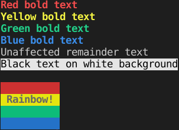

# Colors
A module for printing colored text in Python. The module is a basic wrapper for
the [ANSI color escape codes](https://en.wikipedia.org/wiki/ANSI_escape_code#Colors) that
some (many modern) terminals use to provide color control for text passages.
Using the `printc` function, with a string to format, and a number of color or style constants,
e.g. `RED`, `BOLD`, or `UNDERLINE`, you can output a colored string! Check out the main function in the example file for an example of usage.

## Screenshot

Forgot to include any underlined text, but the `UNDERLINE` setting can be used in place of or in combination with the `BOLD` modifier.